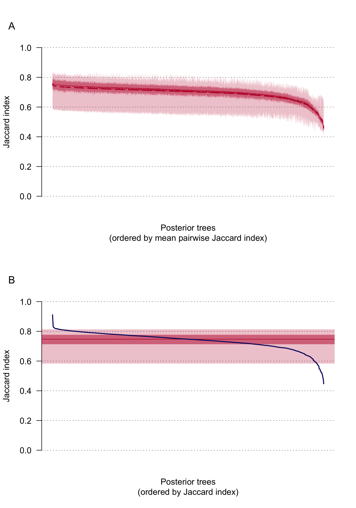
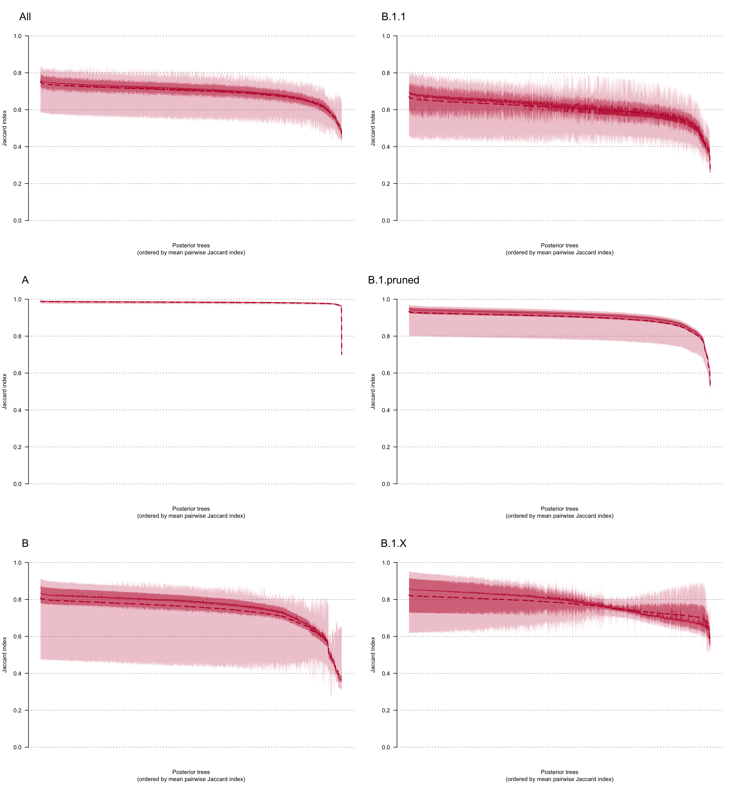
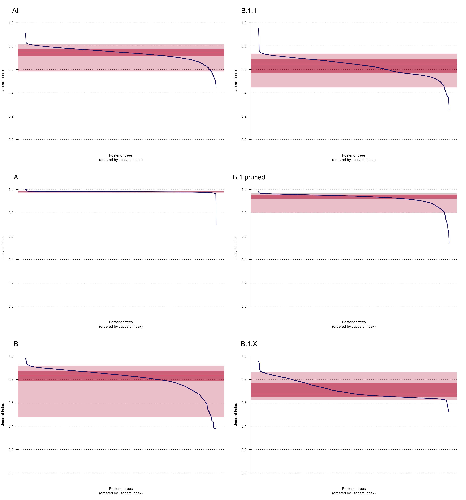

COVID-19 UK introductions
================
Louis du Plessis
Last modified: 27 Nov 2020

-   [Summary](#summary)
    -   [Input](#input)
    -   [Output](#output)
-   [Calculate Jaccard indices](#calculate-jaccard-indices)
    -   [All pairs of posterior trees](#all-pairs-of-posterior-trees)
    -   [MCC tree vs posterior trees](#mcc-tree-vs-posterior-trees)
-   [Plot lineage similarity](#plot-lineage-similarity)
-   [Session info](#session-info)

Summary
=======

Compare similarity of lineage assignments across posterior trees and the MCC tree, using the Jaccard index. Rand index is not suitable - because of the large number of lineages the Rand index is dominated by true negatives and essentially reduces to (1-eps)/1.

Input
-----

-   Cluster statistics for MCC trees and across posterior trees as produced (in `inputpath`):
    -   `clusterSamples_DTA.csv`
    -   `clusterSamples_DTA_MCC_0.5.csv`

Output
------

-   Jaccard indices (in `.csv` files).
-   Jaccard index figures.

Calculate Jaccard indices
=========================

All pairs of posterior trees
----------------------------

Pairwise calculation on a 2000x2000 matrix: : 65444.717 sec elapsed

Pairwise calculation on a 2000x2000 matrix: : 43.607 sec elapsed

Pairwise calculation on a 2000x2000 matrix: : 3183.341 sec elapsed

Pairwise calculation on a 2000x2000 matrix: : 14538.457 sec elapsed

Pairwise calculation on a 2000x2000 matrix: : 4770.699 sec elapsed

Pairwise calculation on a 2000x2000 matrix: : 353.199 sec elapsed

MCC tree vs posterior trees
---------------------------

Comparing 7 MCC trees to 2000 posterior trees: : 603.99 sec elapsed

A: Comparing 7 MCC trees to 2000 posterior trees: : 0.455 sec elapsed

B: Comparing 7 MCC trees to 2000 posterior trees: : 109.268 sec elapsed

B.1.1: Comparing 7 MCC trees to 2000 posterior trees: : 533.126 sec elapsed

B.1.pruned: Comparing 7 MCC trees to 2000 posterior trees: : 166.614 sec elapsed

B.1.X: Comparing 7 MCC trees to 2000 posterior trees: : 10.335 sec elapsed

Plot lineage similarity
=======================

Pairwise Jaccard indices between the lineage assignments on the 2000 posterior trees.

**(A)** Median (solid line) and mean (dashed line) Jaccard indices comparing the classification of UK genomes into transmission lineages and singletons on each of the 2000 posterior trees to the 1999 other trees. Dark shading shows the interquartile range and lighter shading the 95% CI. **(B)** Jaccard indices comparing the classification of UK genomes into transmission lineages and singletons on the MCC trees to each of the 2000 posterior trees (blue line). The solid red line indicates the median Jaccard index, dark shading the interquartile range and lighter shading the 95% CI.

Medians (solid lines) and means (dashed lines) Jaccard indices comparing the classification of UK genomes into transmission lineages and singletons on each of the 2000 posterior trees to the 1999 other trees, for the complete dataset and for each of the large-scale phylogenies individually. Dark shading shows the interquartile range and lighter shading the 95% CI.

Jaccard indices comparing the classification of UK genomes into transmission lineages and singletons on the MCC trees to each of the 2000 posterior trees (blue line), for the complete dataset and for each of the large-scale phylogenies individually. The solid red line indicates the median Jaccard index, dark shading the interquartile range and lighter shading the 95% CI.

Session info
============

    ## R version 3.5.1 (2018-07-02)
    ## Platform: x86_64-apple-darwin15.6.0 (64-bit)
    ## Running under: macOS Sierra 10.12.6
    ## 
    ## Matrix products: default
    ## BLAS: /Library/Frameworks/R.framework/Versions/3.5/Resources/lib/libRblas.0.dylib
    ## LAPACK: /Library/Frameworks/R.framework/Versions/3.5/Resources/lib/libRlapack.dylib
    ## 
    ## locale:
    ## [1] en_GB.UTF-8/en_GB.UTF-8/en_GB.UTF-8/C/en_GB.UTF-8/en_GB.UTF-8
    ## 
    ## attached base packages:
    ## [1] parallel  stats     graphics  grDevices utils     datasets  methods  
    ## [8] base     
    ## 
    ## other attached packages:
    ## [1] cowplot_1.0.0     viridis_0.5.1     viridisLite_0.3.0 ggplot2_3.2.1    
    ## [5] reshape2_1.4.3    clusteval_0.1     tictoc_1.0       
    ## 
    ## loaded via a namespace (and not attached):
    ##  [1] Rcpp_1.0.3         highr_0.8          RColorBrewer_1.1-2 compiler_3.5.1    
    ##  [5] pillar_1.4.2       plyr_1.8.5         tools_3.5.1        digest_0.6.23     
    ##  [9] evaluate_0.14      lifecycle_0.1.0    tibble_2.1.3       gtable_0.3.0      
    ## [13] pkgconfig_2.0.3    rlang_0.4.2        yaml_2.2.0         mvtnorm_1.0-11    
    ## [17] xfun_0.15          gridExtra_2.3      withr_2.1.2        stringr_1.4.0     
    ## [21] dplyr_0.8.3        knitr_1.29         grid_3.5.1         tidyselect_0.2.5  
    ## [25] glue_1.3.1         R6_2.4.1           rmarkdown_2.3      farver_2.0.1      
    ## [29] purrr_0.3.3        magrittr_1.5       scales_1.1.0       htmltools_0.4.0   
    ## [33] assertthat_0.2.1   colorspace_1.4-1   labeling_0.3       stringi_1.4.3     
    ## [37] lazyeval_0.2.2     munsell_0.5.0      crayon_1.3.4
